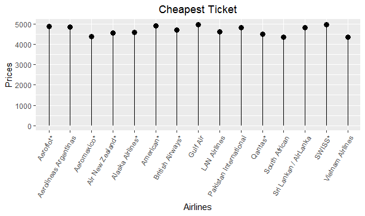
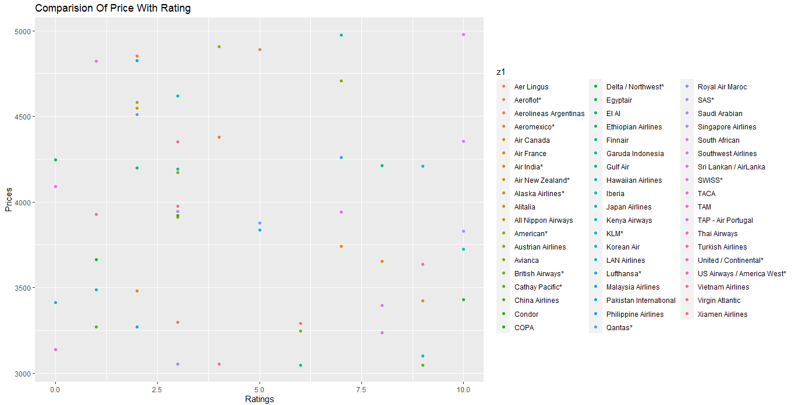
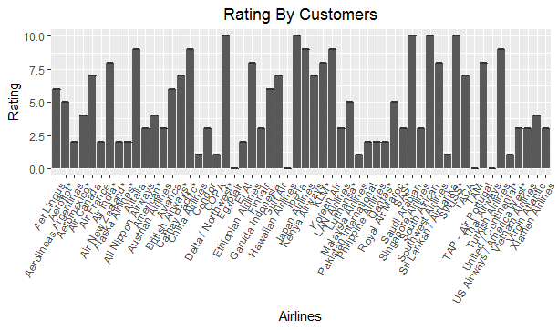
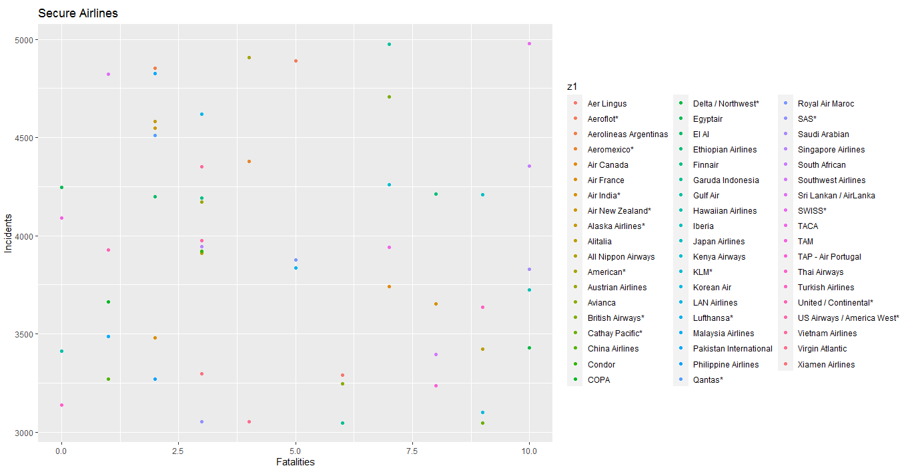

# Flight-Analysis

A college time project that is created using R language. The purpose of this project is to analyse the flight and their performannce with respect to customer satisfaction and the number of incidents occurance. To give best flight able to give best rate with satisfaction result.

<h1>Screenshots</h1>

<table>
  <tr>
    <td></td>
    <td></td>
  </tr>
  <tr>
    <td></td>
    <td></td>
  </tr>
</table>
